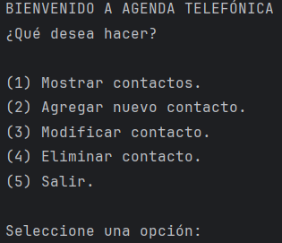
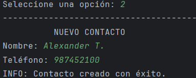
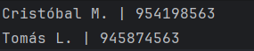

# Sistema agenda telefónica

El proyecto consiste en la elaboración de una agenda 
telefónica en consola que muestre, agregue, modifique, 
elimine contactos, además de guardar y cargar datos de un 
archivo.

Inicialmente, el programa muestra un menú con una serie de 
operaciones que se pueden realizar en la agenda.

También, el proyecto se divide en dos módulos:
- "agenda.py": Contiene el menú del programa.
- "metodos_agenda.py": Contiene las funciones que utiliza 
la agenda.

## Objetivo 

Diseñar e implementar un sistema de gestión basado en 
Python, aplicando los conocimientos adquiridos.

## Elementos que se aplicaron

Los elementos, estructuras, conceptos que se aplicaron son:

- Ciclos for, while
- Listas
- Tuplas
- Diccionarios
- Condicionales
- Funciones
- Uso de módulos
- Validación de datos
- Uso de archivos para guardar y extraer datos

## Funcionamiento

El sistema cargará desde un archivo los contactos registrados, 
simulando una base de datos. Si el archivo no existe, 
se crea uno. Se podrá agregar un contacto que está compuesto 
por el nombre de una persona y un número de teléfono. 
Los componentes del contacto se pueden modificar e incluso 
eliminar. 

En cada interfaz, aparece con letras mayúsculas la opción
elegida. Los campos a completar irán apareciendo una vez
realizada la validación de lo ingresado y habrá un mensaje
que indique el estado de su solicitud.

Al salir del programa, se guardan todos los datos 
ingresados y modificados en un archivo.

## Estructura del contacto

Los contactos van a ser almacenados en un diccionario, 
cuyas clave son el nombre del contacto y el número teléfono 
es el valor. Ej:

{"Valentín Ramos":"954700001",
"José Martínez":"612220033"}