# Sistema Alke Wallet

El proyecto consiste en el desarrollo de una 
billetera digital (Alke Wallet) 
que permita a los usuarios gestionar y administrar 
activos financieros de forma segura y sencilla. Se
deben controlar el acceso, gestión de datos, la 
sincronización del esquema mediante migraciones, 
ejecución de consultas personalizadas e 
implementación de operaciones CRUD.

## Objetivo
Desarrollar una aplicación web funcional 
que permita a los usuarios crear y gestionar 
sus cuentas digitales, realizar transacciones, 
consultar saldos y generar reportes.

## Elementos que se aplicaron

- Autenticación de usuarios
- LoginRequiredMixin
- Forms
- Models
- Views
- Urls
- HTML
- Bootstrap
- CSS
- Django
- CRUD
- SQL

## Funcionamiento

### Pasos previos antes del proyecto.

#### Paso 1

Crear el entorno virtual donde se
desarrolló el proyecto y activarlo(Windows).

- python -m venv venv
- venv\Scripts\Activate

#### Paso 2

Instalar última versión django

- pip install django

#### Paso 3

Crear el proyecto.

- django-admin startproject config .

#### Paso 4

Crear la aplicación.

- python manage.py startapp gestion

#### Paso 5

Crear la base de datos. Por defecto, se usará
sqlite del archivo incorporado del proyecto. En
settings.py se conserva la base de datos mantiene
su configuración por defecto.

    DATABASES = {
    
        'default': {
            'ENGINE': 'django.db.backends.sqlite3',
            'NAME': BASE_DIR / 'db.sqlite3',
        }
    }

En caso de usar PostgreSQL, se debe instalar
el paquete psycopg2.

- pip install psycopg2-binary

La configuración que se hace en settings.py es:

    DATABASES = {
    
            "default": {
            "ENGINE": "django.db.backends.postgresql",
            "NAME": "nombre_bd",
            "USER": "usuario",
            "PASSWORD": "contraseña",
            "HOST": "localhost",
            "PORT": "5432",
        }
    }

### Configuración del proyecto

#### settings.py

En el directorio del proyecto se añadieron 
configuraciones a settings.py.

En INSTALLED_APPS se debe agregar el nombre de la
aplicación.

    INSTALLED_APPS = [

        'django.contrib.admin',
        'django.contrib.auth',
        'django.contrib.contenttypes',
        'django.contrib.sessions',
        'django.contrib.messages',
        'django.contrib.staticfiles',
    
        'gestion',
    ]

El lenguaje del proyecto se establece el
idioma español chileno y la zona horaria de
América/Santiago.

    LANGUAGE_CODE = 'es-cl'
    
    TIME_ZONE = 'America/Santiago'

Se debe agregar el url del login y los
correspondientes a la redirección en caso de login
exitoso y logout.

    LOGIN_URL = "login"
    LOGIN_REDIRECT_URL = "lista_clientes"
    LOGOUT_REDIRECT_URL = "login"

#### models.py

En models.py se hace el registro de los modelos,
que son las clases que van a representar una tabla
que compone a la base de datos que son Cliente, 
Cuenta y Transaccion.

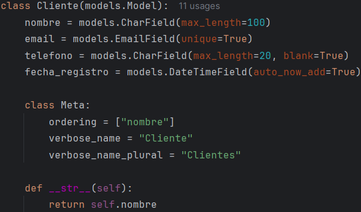

En el caso de Cuenta, existen
2 atributos/campos que son claves representan llaves
foráneas. cliente es un campo uno a uno, ya que
un cliente solo puede tener 1 cuenta y contactos_autorizados
es un campo muchos a muchos, porque muchas cuentas 
pueden tener muchos clientes. Además se define saldo
para que se comporte como atributo usando el decordador
property.

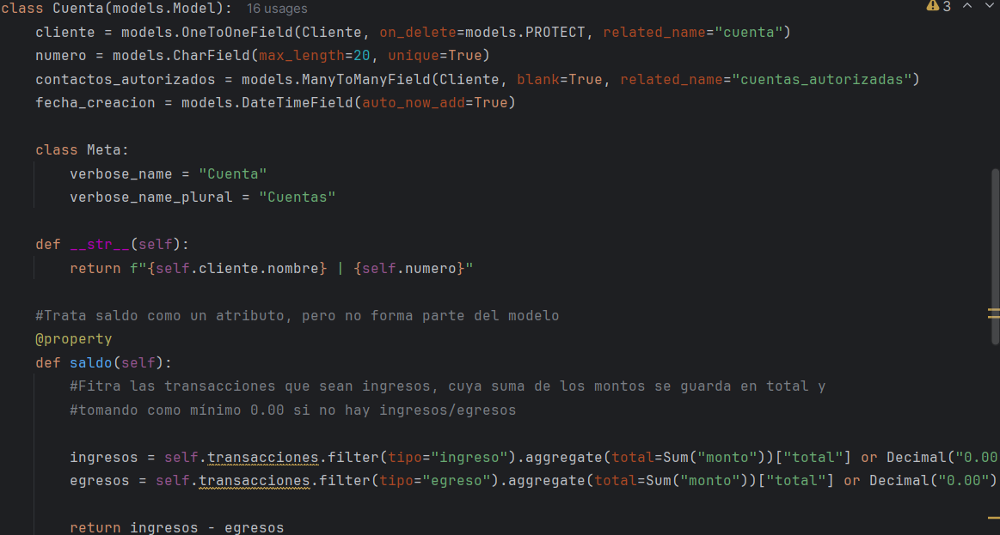

En el caso de Transaccion, debe tener un atributo/campo
cuenta que establece una relación de uno a muchos, 
ya que una cuenta puede hacer muchas transacciones.

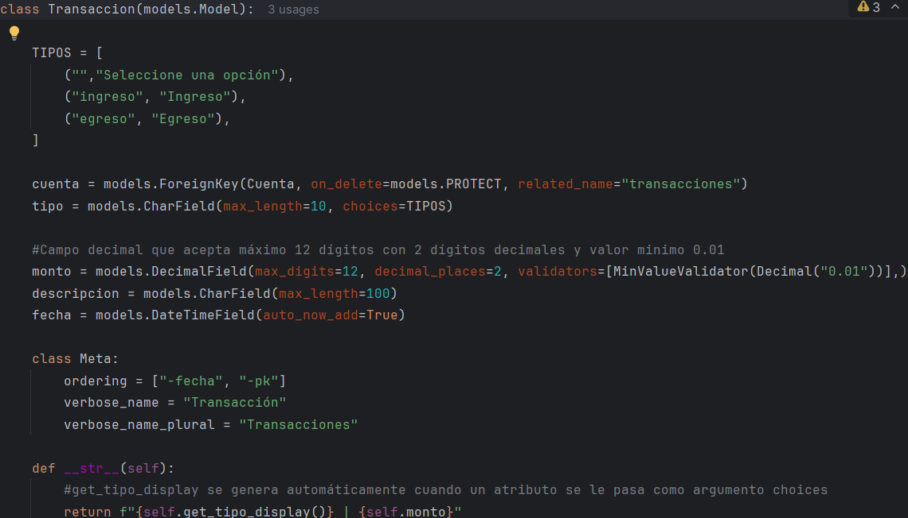

Una vez creado los modelos, se aplican las migraciones
correspondientes, para registrarlos o actualizarlos en
el esquema de la base de datos, sin utilizar sintaxis 
del lenguaje directamente, ya que el archivo generado
en makemigrations contiene las instrucciones.

- python manage.py makemigrations
- python manage.py migrate

Además, se debe crear el superusuario del administrador
django.

- python manage.py createsuperuser

En la terminal pedirá un nombre de usuario, email y
contraseña.

#### admin.py

Lo siguiente es registrar los modelos en admin.py
para visualizarlos en el administrador de django.
Los campos que se ven son aquellos dispuestos en 
list_display de cada modelo. En search_fields se
asignan los campos donde se buscarán coincidencias 
en la barra de búsqueda del administrador. En
list_filter filtra los registros
mostrados de acuerdo a los campos seleccionados.

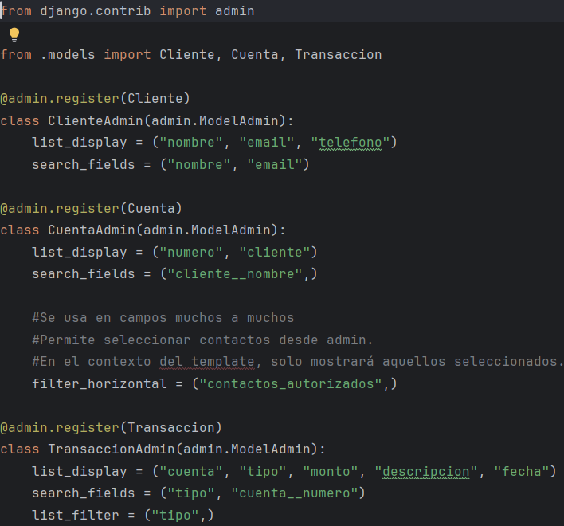

#### forms.py
Se crearon 3 formularios. Los formularios tanto
de cliente como cuenta son usados para registrar y
actualizar datos, mientras que el de transacción solo
registro. Todos los formularios heredan de forms.ModelForm y 
cada campo es personalizado con bootstrap a través
de widgets.

#### urls.py/proyecto

Se registró las urls de la aplicación en
las urls del proyecto. Además, en proyecto se debe
importar vistas de autenticación que son LoginView
y LogoutView. Se importa de views la
vista relacionada con el registro. En el caso de la
url asociada al login se especifica el template
donde se renderiza, además del autorizar la redirección
una vez autenticado el usuario de acuerdo a lo
establecido en settings.py.

    urlpatterns = [
    
        path("admin/", admin.site.urls),

        path("login/", LoginView.as_view(template_name="registration/login.html",redirect_authenticated_user=True,), name="login",),

        path("logout/", LogoutView.as_view(), name="logout", ),

        path("", include("gestion.urls")),
    ]

#### urls.py/aplicación

Las url de la aplicación son 9. En cada una se
realizan acciones como crear, leer, actualizar
y eliminar.

    urlpatterns = [
        path("", ClienteListView.as_view(), name="lista_clientes"),
        path("clientes/crear/", ClienteCreateView.as_view(), name="crear_cliente"),
        path("clientes/<int:pk>/", ClienteDetailView.as_view(), name="detalle_cliente"),
        path("clientes/<int:pk>/editar/", ClienteUpdateView.as_view(), name="editar_cliente"),
        path("clientes/<int:pk>/eliminar/", ClienteDeleteView.as_view(), name="eliminar_cliente"),
        path("clientes/<int:pk>/crear_cuenta", CuentaCreateView.as_view(), name="crear_cuenta"),
        path("clientes/actualizar_cuenta/<int:pk>", CuentaUpdateView.as_view(), name="actualizar_cuenta"),
        path("clientes/eliminar_cuenta/<int:pk>", CuentaDeleteView.as_view(), name="eliminar_cuenta"),
        path("clientes/crear_transacción/<int:pk>", TransaccionCreateView.as_view(), name="crear_transaccion"),
    ]

#### views.py

En views.py se importaron vistas genéricas que son
CreateView, ListView, DetailView, UpdateView y
DeleteView. Cada vista procesa una acción del CRUD, 
se puede definir el model que extraen
campos, el form a mostrar, el template donde
renderizar, el contexto que son los datos a enviar. 
También, poseen métodos para validar
formulario, consultas para retornar registros
específicos, añadir otros datos al contexto y
modificar la redirección a otra página.

Las vistas heredan una clase llamada AccesoPersonalMixin.
En ella se concede el acceso a usuarios logueados y
que sean staff.

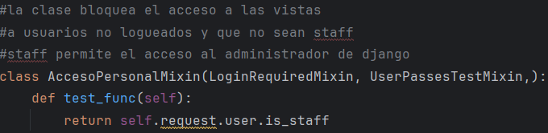

Para las vistas de Cliente se utilizaron las 5 vistas
genéricas para aplicar CRUD. Para Cuentas se usaron 3
para crear, actualizar y borrar, mientras que Transaccion
solo tiene una para crear.

#### Templates
Para el proyecto se elaboró una plantilla base que
heredan todos los html de la aplicación. El directorio
se dividió en 2 subcarpetas que son registration y gestion.
El primero contiene el login de la aplicación, mientras que
el segundo contienen los templates donde se aplica 
CRUD.

#### Configuración del sitio administrativo django

En el administrador, Cliente se
ven los 3 campos asignados en list_display. En la 
barra de búsqueda solo buscará coincidencias 
en los campos nombre y email.

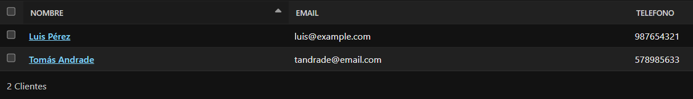

Para Cuenta se ven 2 campos. Se aplica un
filtro horizontal donde se eligen contactos
autorizados y los resultados al realizar
una búsqueda depende del nombre del cliente.

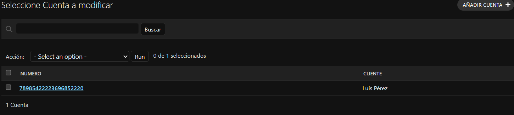

Transaccion muestra 5 campos. Las búsquedas se 
realizan por tipo y número de cuenta y se filtra
por tipo de transacción.

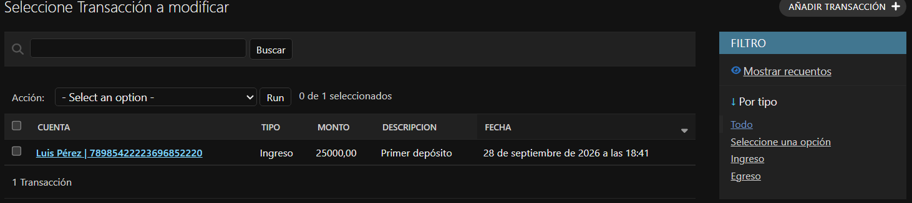

#### Implementación de Operaciones CRUD y Consultas Personalizadas

- Crear registros:

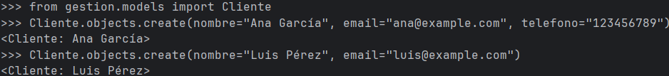
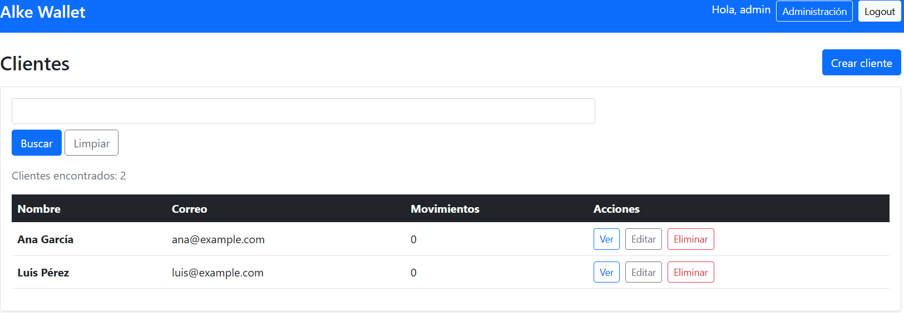

- Actualizar un registro
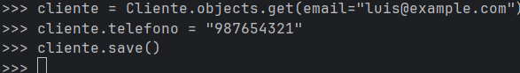
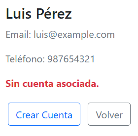

- Eliminar un registro
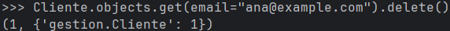
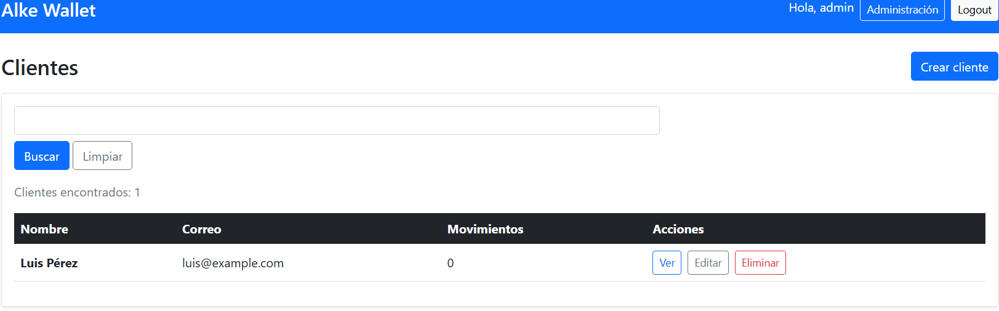

- Consulta personalizada raw: Muestra todos los clientes
cuyo teléfono no sea NULL.
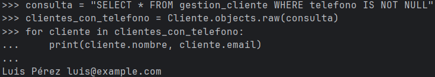

- Consulta personalizada con connection y cursor: Contabiliza
los clientes registrados en la tabla cliente.
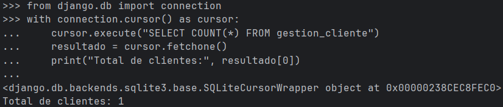

#### Templates

- Lista de clientes vacía

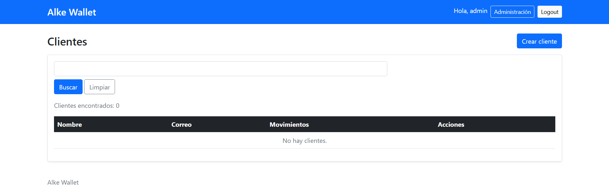

- Lista con clientes

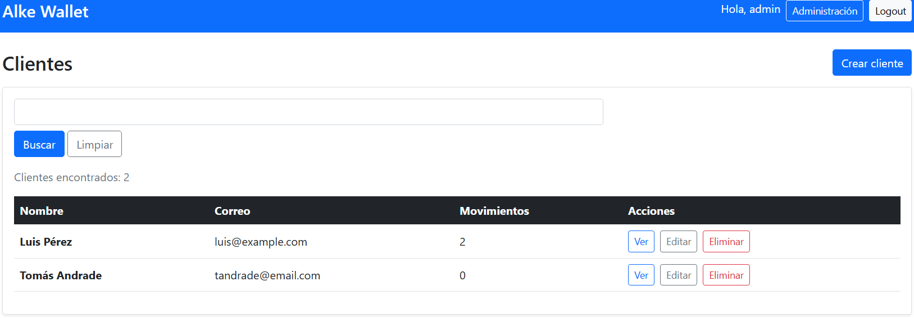

- Crear/Actualizar cliente

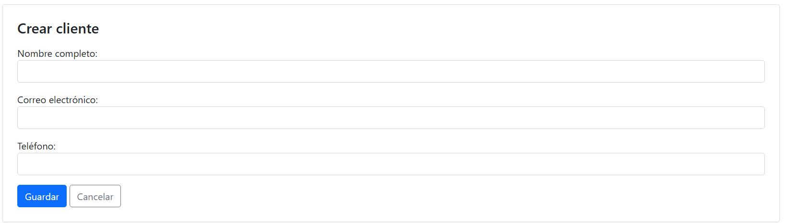

- Detalle cliente sin cuenta

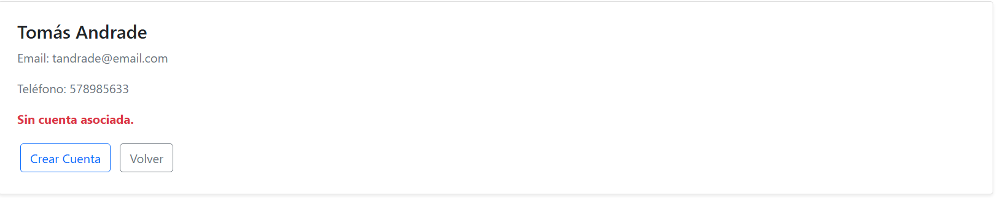

- Crear/Actualizar cuenta

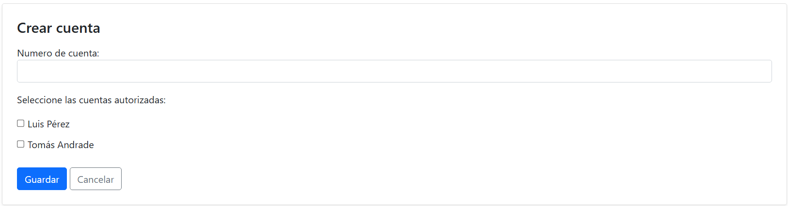

- Detalle cliente con cuenta sin transacciones

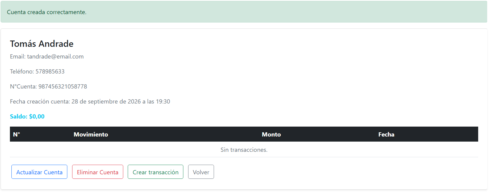

- Detalle cliente con cuenta con transacciones

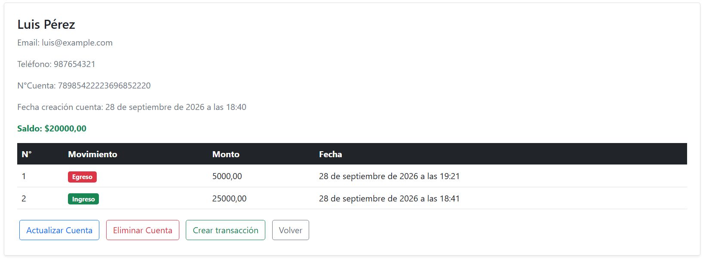