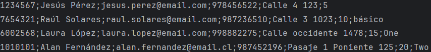
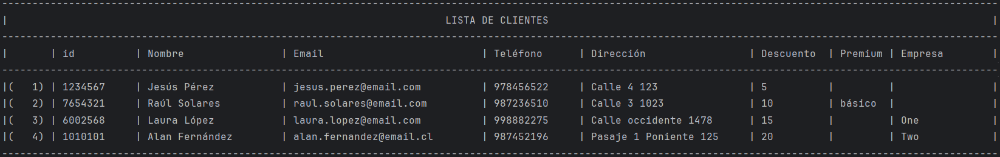
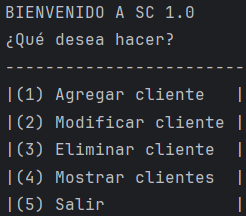
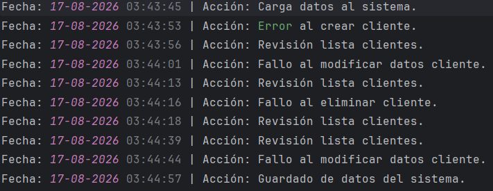
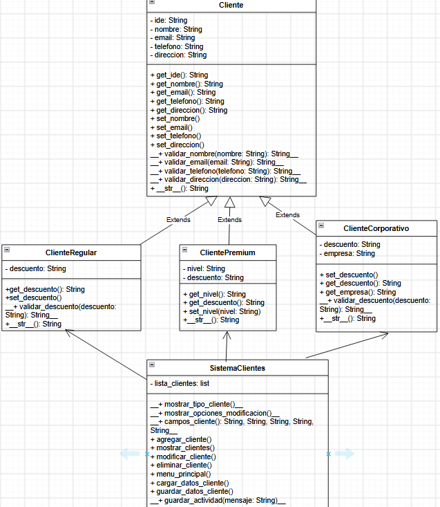

# Sistema gestión de clientes

El proyecto consiste en la creación de un sistema de gestión
de clientes en consola, basado en POO que sea capaz de manejar
distintos tipos de clientes, validaciones personalizadas, 
manejo de persistencia de datos utilizando archivos. Se
aplicaron conceptos de herencia, polimorfismo, encapsulamiento, 
manejo de errores con try-except-finally. Además, se utilizó
un diagrama de clases para mostrar las relaciones entre
las distintas clases.

Inicialmente, el programa muestra un menú con una serie de 
operaciones que se pueden realizar en el sistema, en formato
de tabla.

El sistema se representó utilizando los siguientes módulos
que contienen sus respectivas clases:
- "cliente.py"
- "cliente_corporativo.py"
- "cliente_regular.py"
- "cliente_premium.py"
- "sistema_clientes.py"

## Objetivo

Desarrollar un sistema en Python basada en POO, que permita 
gestionar clientes, realizar validaciones y manejo de errores
personalizados.

## Elementos aplicados

- Ciclos for, while
- Listas
- Tuplas
- If-Elif-Else
- Match
- Clases
- Métodos(instancia y estáticos, públicos)
- Atributos(privados)
- Try-Except-Finally
- Raise
- Archivos

## Funcionamiento

El sistema carga desde un archivo los clientes registrados,
simulando una base de datos. El archivo se crea si no existe.

Visualmente, los datos se mostrarán en formato de tabla, 
donde cada dato está asociado a un campo, excepto la 
primera columna que representa la enumeración del registro.

El sistema puede agregar, modificar, eliminar y mostrar datos
de un cliente.

Por cada opción se genera un registro que
se guarda en un archivo ".log", mostrando si fue exitosa 
o no la operación realizada. Incluye la apertura y 
cierre no forzado del sistema.

## Diagrama de clase del sistema

En el diagrama se puede apreciar las relaciones de 
herencia de la clase "Cliente" cuyas clases hijas son
"ClienteRegular", "ClientePremium" y "ClienteCorporativo".

La clase "SistemaClientes" tiene una relación de asociación
con las clases hijas, ya que guarda todos los clientes 
instanciados a partir de estas.

