# Sistema de gestión de proyectos

El proyecto consiste en el desarrollo de un sistema
que permitirá a los usuarios gestionar 
tarea y proyectos. Además, la aplicación debe
permitir registrar y autenticar usuarios, aplicar
CRUD tanto a proyectos como tareas, bloquear acceso
a contenido si no existe un inicio de sesión.

## Objetivo

Desarrollar una aplicación web en Django que permita
a los usuarios registrarse, autenticarse, gestionar
proyectos y tareas, y visualizar sus datos de 
manera dinámica.

## Elementos que se aplicaron

- Autenticación de usuarios
- LoginRequiredMixin
- Forms
- Models
- Views
- Urls
- HTML
- Bootstrap
- CSS
- Django

## Funcionamiento

### Pasos previos antes del proyecto.

#### Paso 1

Crear el entorno virtual donde se
desarrolló el proyecto y activarlo(Windows).

- python -m venv venv
- venv\Scripts\Activate

#### Paso 2

Instalar la versión 5.2 de django y 
mysql para que sean compatibles.

- pip install "django==5.2.*"
- python manage.py mysqclient

#### Paso 3

Crear el proyecto.

- django-admin startproject gestor_tareas .

#### Paso 4

Crear la aplicación.

- python manage.py startapp tareas

#### Paso 5

Crear la base de datos. Para este caso, se hizo
en mysql workbench.

- CREATE DATABASE orm CHARACTER SET utf8mb4 COLLATE utf8mb4_unicode_ci;

### Configuración del proyecto

#### settings.py

En el directorio del proyecto se añadieron 
configuraciones a settings.py.

En INSTALLED_APPS se debe agregar el nombre de la
aplicación.

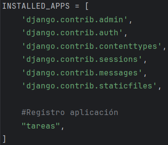

En DATABASES se agrega la base de datos, especificando
el motor a usar, nombre, usuario, contraseña, host,
puerto y opciones del tipo de caracter a usar.

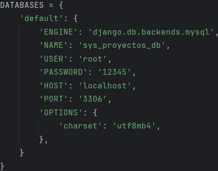

En el lenguaje del proyecto se establece el
idioma español chileno y la zona horaria de
América/Santiago.

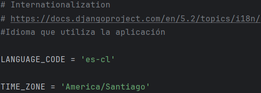

Se debe agregar el url del login y los
correspondientes a la redirección en caso de login
exitoso y logut.

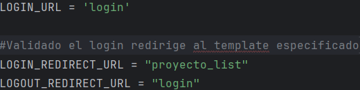

Se añade en la base del proyecto el directorio
static para guardar archivo de css.

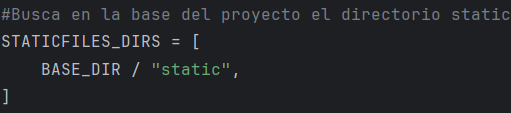

#### models.py

En models.py se hace el registro de los modelos,
que son las clases que van a representar una tabla
que compone a la base de datos que son Proyecto y
Tarea. Es importante que en proyecto exista un
atributo que representa una llave foránea al modelo
User que viene incorporado en django, ya que la
aplicación solo debe mostrar los proyectos 
asociados al usuario logueado.

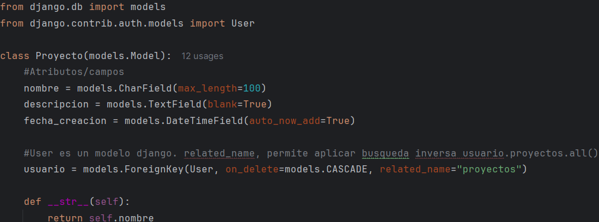

En el caso de Tarea, debe tener un atributo
foráneo al proyecto asociado.

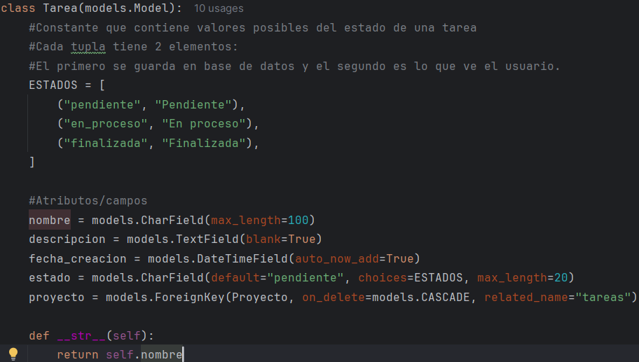

Una vez creado los modelos, se aplican las migraciones
correspondientes, para registrarlos, incluso si ya
existen, pero hicieron alguna modificación.
Permite la creación de tablas o modificacion a la
base de datos en MySQL sin utilizar sintaxis propia
del lenguaje directamente, ya que el archivo generado
en makemigrations contiene las instrucciones.

- python manage.py makemigrations
- python manage.py migrate

Además, se debe crear el superusuario del administrador
django.

- python manage.py createsuperuser

En la terminal pedirá un nombre de usuario, email y
contraseña.

#### admin.py

Lo siguiente es registrar los modelos en el admin.py
para verlos en django admin. Los campos a mostrar en
la plataforma son aquellos en list_display. Los
ubicados en search_fields son los campos en que se
buscaran posibles resultados en la barra de búsqueda
del administrador. Y List_filter filtra los registros
mostrados de acuerdo a los campos seleccionados.

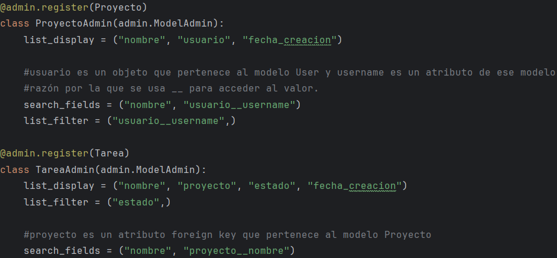

#### forms.py

Para poder registrar usuarios, crear, actualizar
tanto proyectos como tareas, se hizo uso de
formularios. Para el registro, RegistroUsuarioForm
que hereda UserCreationForm, un formulario que
ya viene incorporado en django. En el form se declara
el campo email, ya que el form heredado, no
contiene ese campo. En el meta, se especifica el
modelo User y los campos a completar.

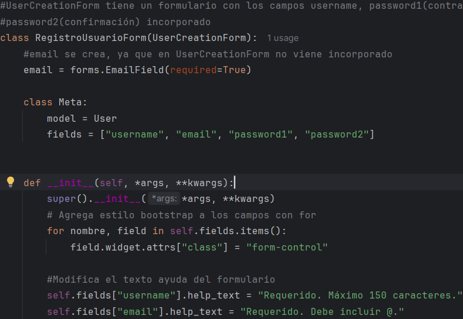

El formulario de proyectos y tareas se llaman
ProyectoForm y TareaForm, respectivamente. Ambos
heredan de forms.ModelForm, que puede entenderse
como una plantilla vacía cuyos campos dependen
del model asignado en Meta. Además, los campos
del formulario, se les aplica bootstrap usando
widgets.

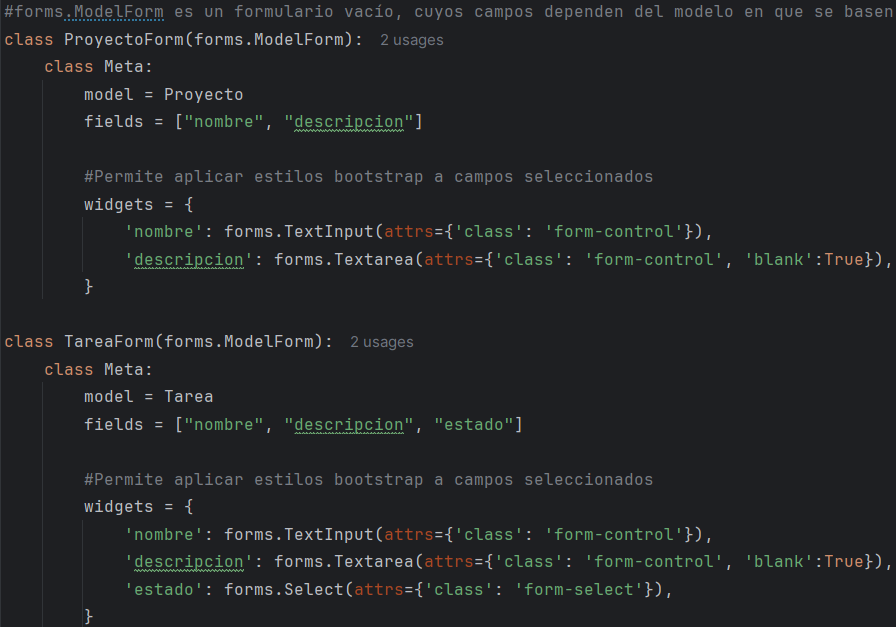

#### urls.py/proyecto

Se debe registrar las urls de la aplicación en
las urls del proyecto. Además, en proyecto se debe
importar vistas de autenticación que son LoginView
y LogoutView. Por último, se importa de views la
vista relacionada con el registro.

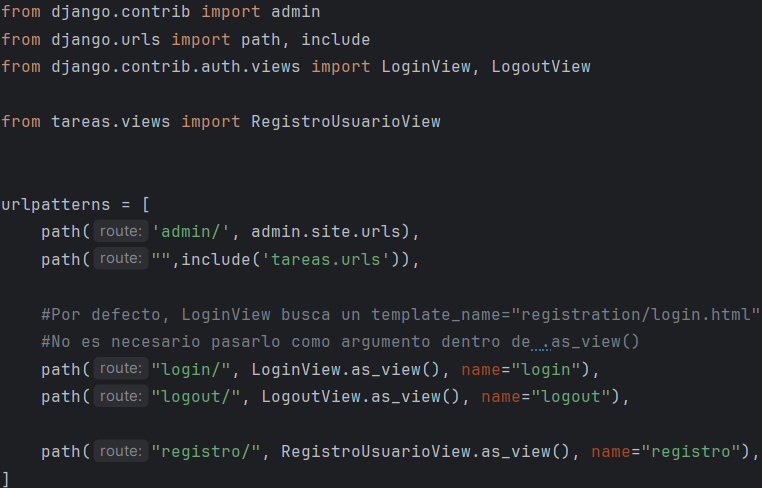

#### urls.py/aplicación

Las url de la aplicación en total 8. En cada una se
realizan acciones como crear, leer, actualizar
y eliminar.

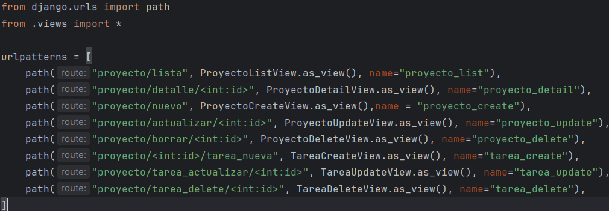

#### views.py

En views.py se importaron vistas genéricas que son
CreateView, ListView, DetailView, UpdateView y
DeleteView. Cada vista procesa una acción concreta.
En ellas se puede definir el model que extraen
campo, el form a mostrar, el template donde
renderizar, el contexto que son los datos a enviar
al template. Cuentas con métodos para validar
formulario, consultas para retornar registros
específicos, añadir otros datos al contexto y
modificar la redirección a otra página.

Todas las vistas desarrolladas, excepto la de
registro de un nuevo usuario, requieren de un
bloqueo a su contenido, por lo que se requiere
importar LoginRequiredMixin que exige un inicio
de sesión para acceder a una vista. LoginRequiredMixin
se coloca en la declaración de la clase vista como
herencia. Debe ser el primer objeto que herede antes
que la vista genérica.

En caso de querer acceder a un template sin iniciar
sesión, el navegador redirecciona a la url especificada
en LOGIN_URL que es login.

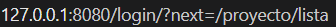

Si no se especifica LOGIN_URL, el navegador mostrará
el error 404.

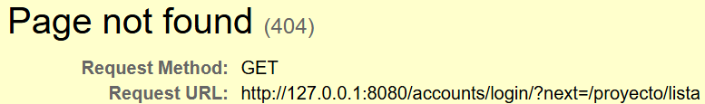

Y en caso de colocar LoginRequiredMixin después
de la vista genérica provoca un TypeError.

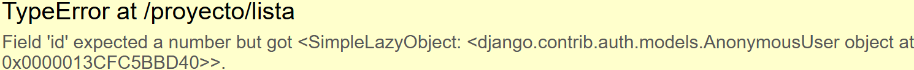

#### Templates
Ya creada las vistas, se debe subir el proyecto al servidor
local con:
    
- python manage.py runserver

Si el puerto 8000 que ocupa django por defecto está
ocupado especificar otro número en el comando.

El directorio templates se dividió en dos 
subdirectorios registration y tareas. El primero
se crea porque LoginView por defecto busca un
template llamado registration/login, mientras que
el segundo guarda todos los template asociados a
proyecto y tareas.

Se desarrolló un template base.html para que todas
las plantillas hijas hereden las etiquetas y
configuraciones del padre. Se hace la carga del
archivo de estilos con CSS con  y
se añade bootstrap.

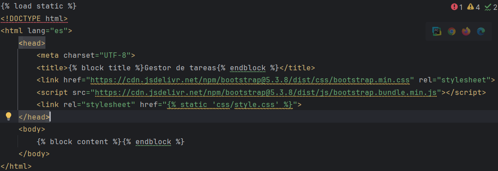

### Configuración del sitio administrativo django

Una vez registrado los modelos en el administrador
de django, la interfaz visual será distinta dependiendo
de cómo se configuró. En el caso de Proyecto se
ven los 3 campos asignados en list_display. El filtro
depende del usuario seleccionado y en la barra de
búsqueda solo buscará coincidencias en los campos
de nombre y usuario.

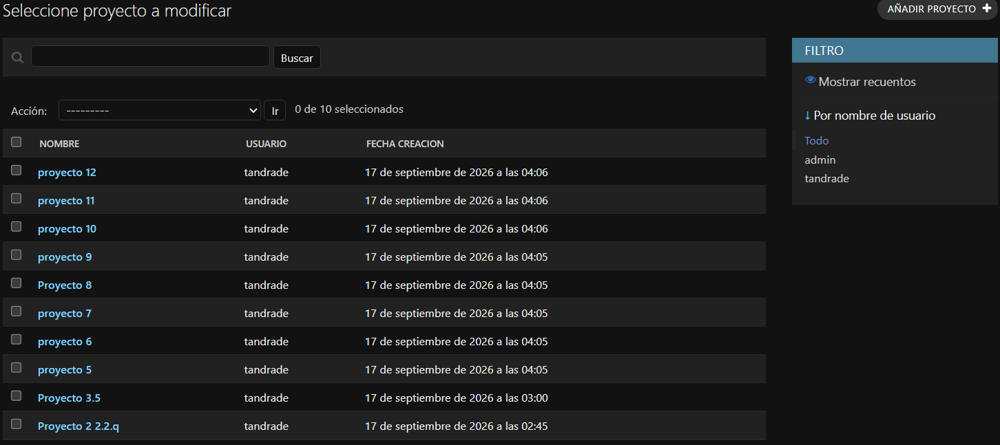

Para Tarea se ven 4 campos. El filtro de las tareas
depende de su estado y los resultados al realizar
una búsqueda dependen del nombre de la tarea y
proyecto.

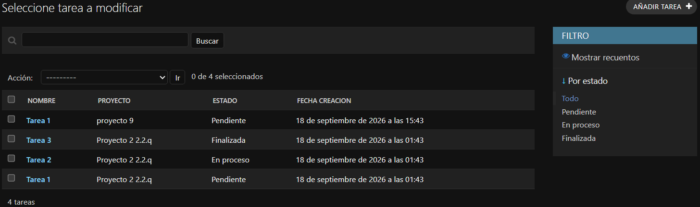

### Templates desarrollados

#### Login

Muestra inicial
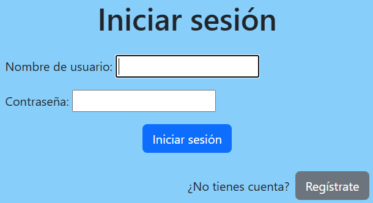

Login con mensaje de error
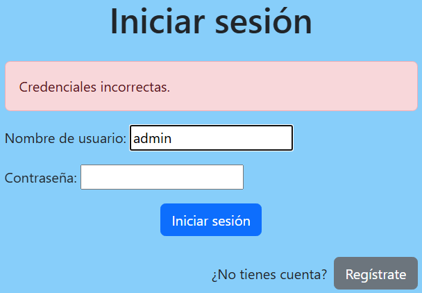

#### Registro nuevo usuario

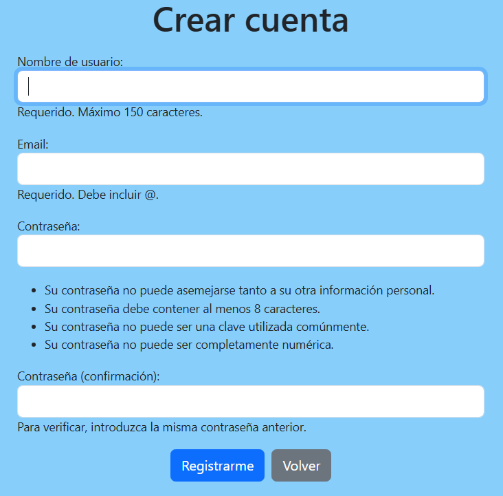

#### Lista Proyectos

Sin proyectos

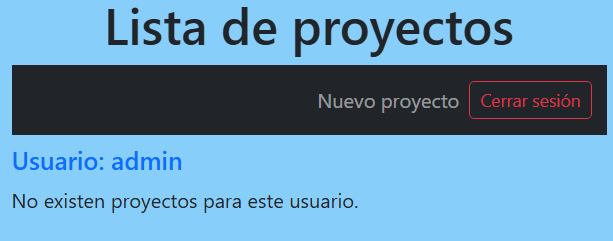

Con proyectos

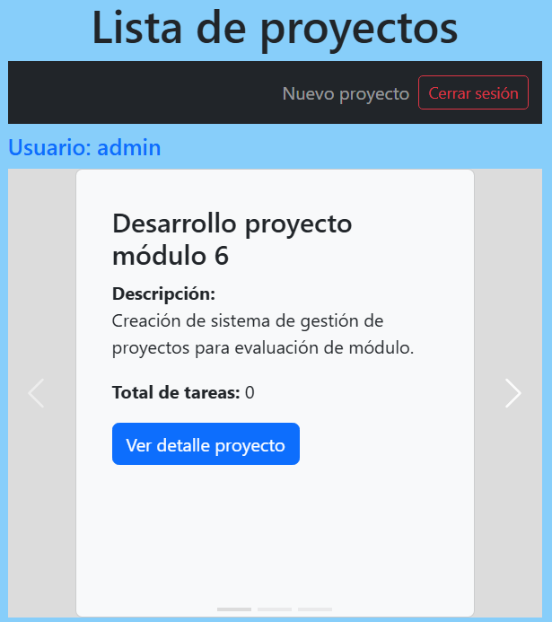

#### Detalle proyecto

Sin tareas

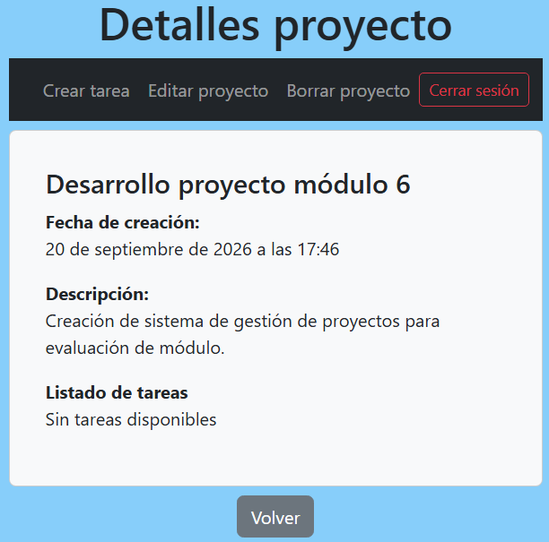

Con tareas

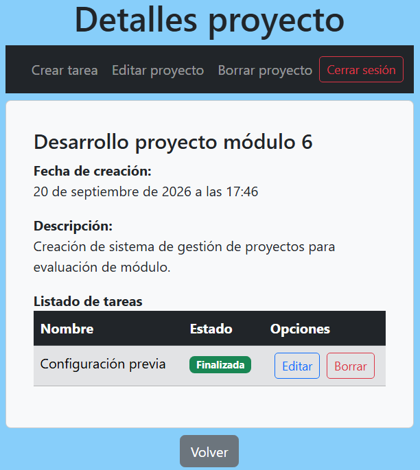

##### Nuevo proyecto

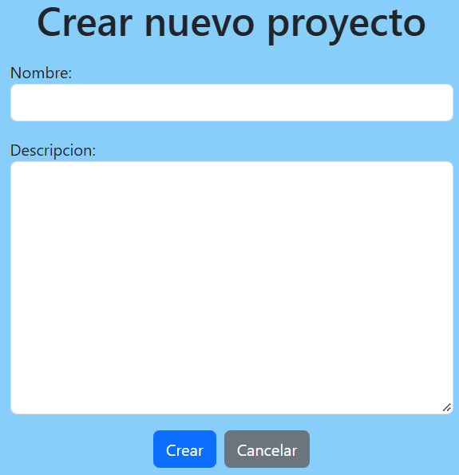

#### Editar proyecto

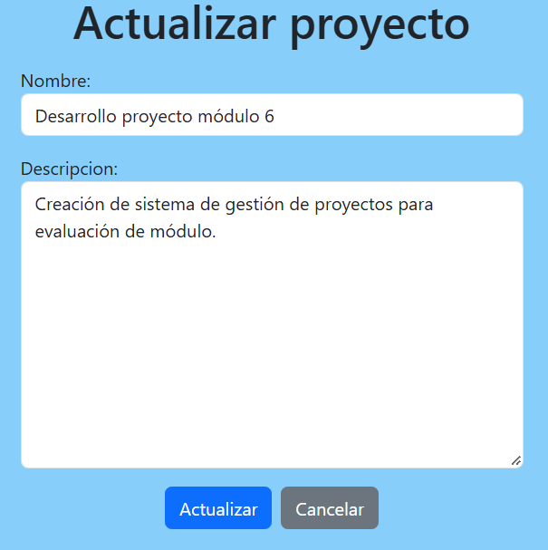

#### Eliminar proyecto

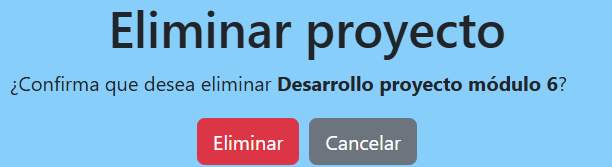

#### Crear tarea

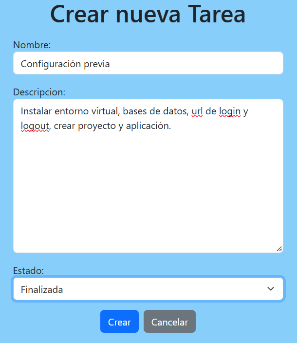

### Actualizar tareas

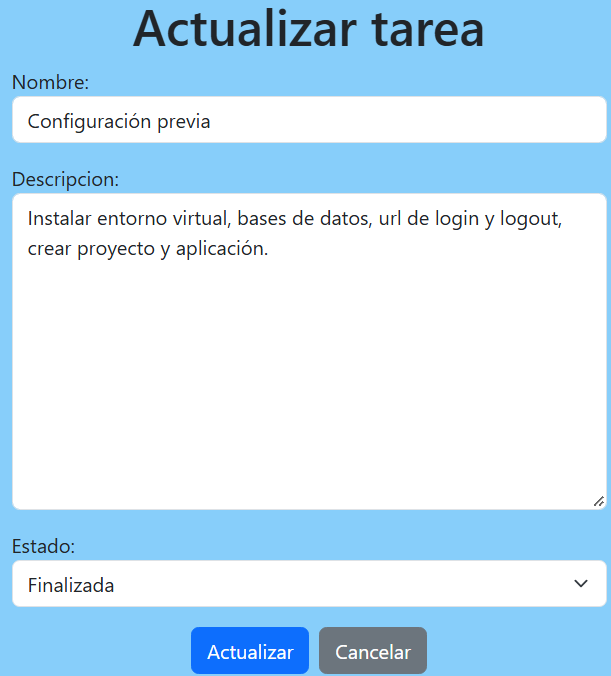

#### Eliminar tarea

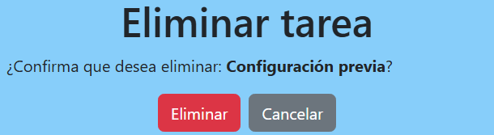

